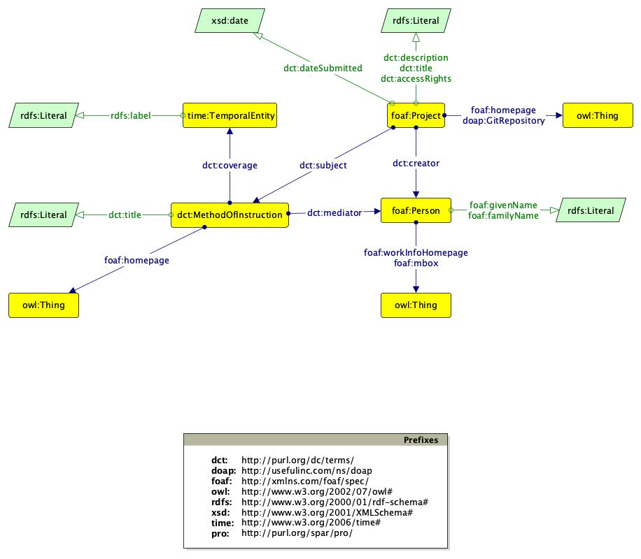

# DHDKey!

DHDKey! (Digital Humanitites and Digital Knowledge Educational Yearbook) is an online database devoted to the collection and publication of metadata of all projects developed by students of the master course of [Digital Humanitites and Digital Knowledge at the University of Bologna](https://corsi.unibo.it/2cycle/DigitalHumanitiesKnowledge). DHDKey! is a platform developed and managed by students for students. 

## Overview

The idea behind DHDKey! is not only to organize all the projects carried out during the course in a historical collection but also to provide all students of the course with their own academic portfolio.

### User Interaction

DHDKey! is designed to make students responsible for the data upload process.
All students of the Digital Humanities and Digital Knowledge course can upload their project data through the appropriate form provided by the website.
After filling in the data, the information is processed through a data cleaning system (e.g. capitalization of names and removal of excess blank spaces). The data is finally saved in json format in a temporary directory.
At the end of the process, the user will receive an email confirming the data to the address provided in the form.
Once the data is confirmed, the information will be evaluated by a moderator admin and finally published.

The confirmation email sent to the user expires after 24 hours. After the expiration the json file containing the information will be removed from the temporary folder and it will be necessary to recompile the form.

### Admin Tools

The DHDKey! platform includes an area dedicated to platform administrators (student representatives and student tutors). In this area, accessible only through admin credentials, you can perform different actions: 
- **Confirm Project:** As described above, each published project requires the approval of an administrator. In this section the admin will be able to view all projects awaiting confirmation and possibly confirm them.
- **Edit Projects:** In this section an admin can manage all the projects currently online. Depending on needs, an admin can make a project offline (reversible process) or remove it permanently (irreversible process).
- **Upload Courses CSV:** Every year the Digital Humanitites and Digital Knowledge course has a new curriculum, with updated teaching courses (e.g. the Unibo webpage of the individual teaching). In this section the admin can add new courses by uploading a special csv file (whose structure is provided in the website in the appropriate section). Once uploaded the new teaching course will be available among those selectable in the upload form, within its own academic year.

- **Rename Author:** In this simple form it is possible, through an email address (used as an identifier), to edit the name and surname of an author.

- **Download Dump:** This area is dedicated to downloading the RDF dump file and the courses CSV. In particular, **these operations are recommended before any maintenance of the website**.

## Back-End

The Back-End is entirely developed in Python (version 3.8.2) through [Flask web framework](https://flask.palletsprojects.com/en/1.1.x/). The published data are instead stored in a Triplestore.

### Structure

The code is organized in the following structure:

- `run.py` #Simple running function
- app/
	- `__init__.py` app package init file defining general variables
	- `routes.py` module defining different URLs that the application implements
	- support/
		- `__init__.py` support package init file
		- `admin_support.py` module handling admin login through [flask_login](https://flask-login.readthedocs.io/en/latest/)
		- `data_support.py` module handling raw data cleaning (uploaded data json and courses csv)
		- `mail_support.py` module handling email sending through [flask_mail](https://pythonhosted.org/Flask-Mail/)
		- `rdf_support.py` module handling rdf creation using uploaded data json through [rdflib](https://rdflib.dev/) 
		- `routine_support.py` module handling routine actions (dump and uploaded data json  expiration)
		- `SPARQL_support.py` module handling SPARQL queries to Triplestore through [SPARQLwrapper](https://rdflib.dev/sparqlwrapper/)

### Triplestore

All data published by DHDKey! are in RDF format with N-Quads serialization. The graphs are stored in a [Blazegraph Triplestore](https://blazegraph.com/) from which a rdf dump file is generated every day.

## Data Model

As mentioned above, rdf data is serialized in N-Quads since the metadata of each project is stored in a corresponding graph. Each graph conforms to the following data model described by a [Graffoo](https://essepuntato.it/graffoo/) diagram:

In particular, the following ontologies are reused:
- DCMI metadata terms (dct, http://purl.org/dc/terms)
- Description of a Project (doap, http://usefulinc.com/ns/doap)
- Friend of a Friend (foaf, http://xmlns.com/foaf/spec)
- Time (time, http://www.w3.org/2006/time)

## Front-End

The front end of DHDKey! has been designed mainly through [Bootstrap framework toolkit](https://getbootstrap.com/) (version 4.3.1) and [Jquery](https://jquery.com/) (version 3.3.1). Great attention has been given in design the interface to display the projects stored in DHDKey!.

### Faceted Search

Website users can navigate through the published projects through a faceted search interface.
Faceted search is a technique that allows users to narrow the search results by applying multiple filters based on a classification (in this case: Academic Year and Course).

This particular interface was implemented using the [ItemsjsAPI search engine](https://www.itemsapi.com/blog/2017/11/25/search-engine-with-facets-in-javascript/) (version 1.0.37) integrated with the [Vuejs framework](https://vuejs.org/) (version 2.6.11) using the [vuejs-paginate plugin](https://github.com/lokyoung/vuejs-paginate) (version 2.1.0) to manage the layout of the results.

Finally, to facilitate the search for projects by author, a select box has been implemented using [Select2](https://select2.org/) (version 4.0.13).

### Icons

All icons on the DHDKey website (including favicon) come from [Font Awesome icon set](https://fontawesome.com/) (version 5.8.1).
